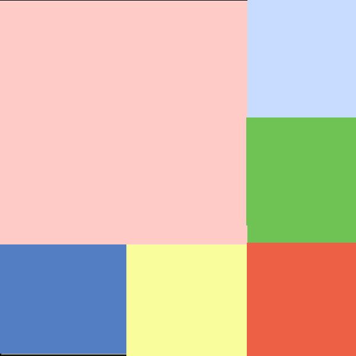

# 基础知识
## Date
### 1、'2016-06-25 10:00:00'
    方法一：
    getTime: function() {
        var date = new Date();
        var year = date.getFullYear();
        var month = date.getMonth() + 1;    //(1)
        var day = date.getDate();

        var hour = date.getHours();
        var minute = date.getMinutes();
        var second = date.getSeconds();

        var result = year + '-' + month + '-' + day + ' ' + hour + ':' + minute + ':' + second;

        return result;
    }

        //位数补齐
        (1) 通过与 10大小判断
        (2) 数组方式
    
    方法二：
    Date对象的几个方法
    var d = new Date();
    d.toDateString()    //"Sun Jul 24 2016"
    d.toISOString()     //"2016-07-24T02:37:15.443Z"
    d.toGMTString()     //"Sun, 24 Jul 2016 02:37:15 GMT"
    d.toUTCString()     //"Sun, 24 Jul 2016 02:37:15 GMT"
    d.toTimeString()    //"10:37:15 GMT+0800 (中国标准时间)"
    d.toLocaleString()  //"2016/7/24 上午10:37:15"
    d.toLocaleDateString()  //"2016/7/24"
    d.toLocaleTimeString()  //"上午10:37:15"
    d.toJSON()   //"2016-07-24T02:37:15.443Z"

    getTime: function() {
        var d = new Date(+new Date()+8*3600*1000);  //转换为东八区时间
        var str;
        str =  d.toJSON().replace(/T/g, ' ').replace(/\.[\d]{3}Z/, '');

        return str;
    }

    getTime: function() {   //同样需要补齐位数
        var d = new Date().toLocaleString().replace(/\//g, '-').replace(/[上下午]/g, '');
        return d;
    }
    
## http协议
### contentType
contentType取值有以下几种：
multipart/form-data
## form表单序列化
jQuery的serialize()

    firstName=Bill&lastName=Gates   //会对中文字符和特殊字符转换成UTF-8编码  

### checkbox
### 英文双引号转义
## 提取富文本内容，保留段落格式

*问题描述*

app发帖和pc发帖需保持相同的段落格式。pc目前使用的插件可以直接获取输入的富文本形式，但由于app无法解析富文本，需将内容转换为app可识别的段落格式。

*思路*

首先我考虑的是通过正则表达式匹配尖括号<>并删除所有的html标签，只保留其内容，并将p和div的内容后追加\r\n，以满足app需求。
这个方法存在的问题：若用户手动输入了尖括号，或者html标签，如<a>、<happy>这种形式的内容，则也会被过滤掉，不是一个很好的方案。

*最后采用的方案*

通过递归的方法遍历所有dom节点，通过nodeType、nodeName、nodeValue等属性得到最后结果。

    getNodeText(node) {
        var rs = [];
        if (node.nodeName == 'P' || node.nodeName == 'DIV') {
            rs.push('\r\n');
        }
        if (node.nodeType == 3) { //textnode
            rs.push(node.nodeValue);
        }

        var childNodes = node.childNodes;

        if (childNodes.length) {
            for (var i = 0, len = childNodes.length; i < len; i++) {
                rs.push(this.getNodeText(childNodes[i]));
            }
        }

        return rs.join('');
    }

## node服务器代理
## 函数作用域绑定
### es6 箭头函数
## canvas
**问题描述**

通过图示布局展示图片，其中每个色块代表一张图片

**思路**
如上图所示，若采用css布局方法，比较繁琐，其需要为每块位置标记id，以将对应图片添加到所处位置。
而html5的canvas为我们提供了很方便的操作图片的方法，可以将img显示到特定位置。因此最终我采用了canvas绘图的方法

**方案**
这里采用的是通过canvas的drawImage方法绘制图片

    var position = [
        {x: 0, y: 0, w: 200, h: 200},
        {x: 200, y: 100, w: 100, h: 100},
        {x: 100, y: 200, w: 100, h: 100},
        {x: 200, y: 200, w: 100, h: 100},
        {x: 200, y: 0, w: 100, h: 100},
        {x: 0, y: 200, w: 100, h: 100}
    ];

    if (resultMessage.length) {
        for (var i = 0; i < 6; i++) {
            (function(i) {
                var imgUrl = resultMessage[i].imageSrc;
                var img = new Image();
                img.onload = function() {
                    context.drawImage(img, position[i].x, position[i].y, position[i].w, position[i].h);
                }
                img.src = imgUrl;
            })(i);
        }
    }

**拓展小demo-画布**
[画布demo](http://output.jsbin.com/sohahevipa)

## 动态获取url
## 空数组的true和false

# 框架 —— Backbone

# 项目结构

# 工作流程

# 小技巧

# 不足